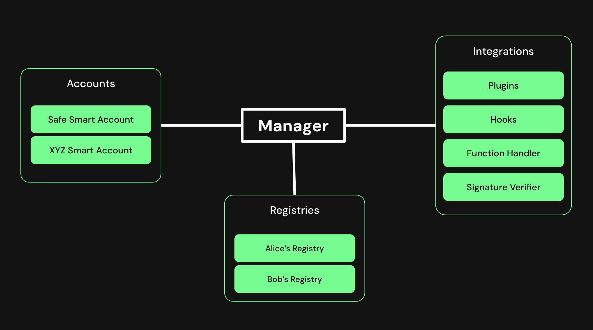

# Safe Protocol Specs

## Motivation

- Enable easy integration of different components
- Provide security/ safety to the user
- Provide a common interface to build tooling on top (i.e. indexers)
- Provide a system for all smart contract accounts to make use of

## Objective

The objective of the protocol is to **enforce** the **correct conduct and procedures** of a system of rules of the **Safe ecosystem**

[read more](/objective/README.md)

## Architecture

The Safe Protocol is made up of different parts. At the core of the protocol is the `Mediator` which connects the `Accounts` with the different `Components` using the `Registry` for governance of the protocol. Each of these parts has their specific responsibilities and the architecture is designed to clearly separate these pieces by defining concrete interfaces. This will allow that each of the parts can be independently be extended and iterated on, enabling the protocol to grow and evolve.

### Mediator

As the core part of the protocol the `Mediator` is responsible to **enforce** the correct conduct and procedures in the protocol. For this the Mediator sits between the `Accounts`and `Components` and acts as a intermediate layer that mediates all the communication and interaction between these.

[read more](/mediator/README.md)

### Accounts

The `Acccounts` represent the users in the ecosystem. Users can come in many forms, such as individuals, teams or DAOs, that use these accounts to interact with the web3 ecosystem.

[read more](/accounts/README.md)

### Components

Smart contract based accounts bring a lot of flexibility. To maximize on this flexibility the goals of the Safe project is to foster a **Safe ecosystem** of `Components` that cover all different kinds of use cases, ultimately briding web2 and web3.

[read more](/components/README.md)

### Registry

For the Safe ecosystem to grow in a healthy way it is important to define the expected (or **correct**) **conduct and procedures**. This is done in the registry. Only `Components` that follow these will be handled by the `Mediator`. 

[read more](/registry/README.md)

### Meta Information

To put all the parts and their interactions into context it is important to provide (meta) information. These information will allow developers to add additional information to interactions so that the users can understand what is happening and what they are interacting with.

[read more](/meta_information/README.md)