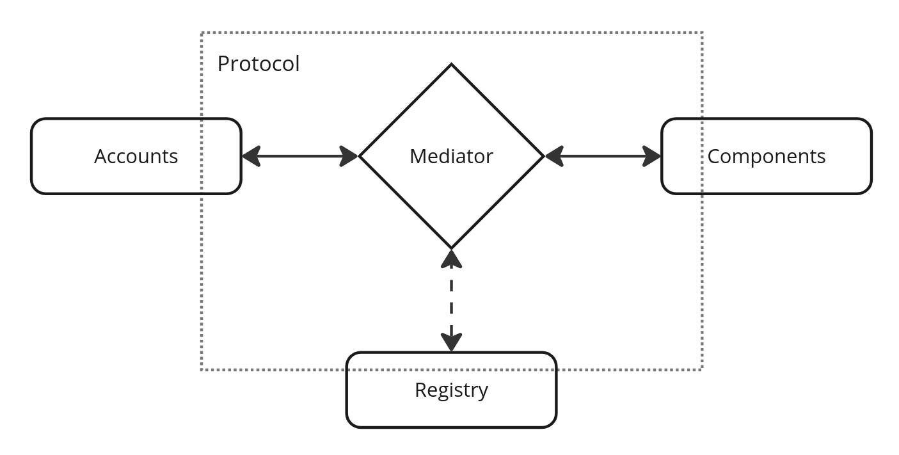

# Safe Protocol Specs

## Motivation

- Enable easy integration of different components
- Provide security/ safety to the user
- Provide a common interface to build tooling on top (i.e. indexers)
- Provide a system for all smart contract accounts to make use of

## Objective

The objective of the protocol is to **enforce** the **correct conduct and procedures** of a system of rules of the **Safe ecosystem**

[read more](objective/README.md)

## Architecture

### Mediator

[read more](mediator/README.md)

### Accounts

[read more](accounts/README.md)

### Components

[read more](components/README.md)

### Registry

[read more](registry/README.md)
