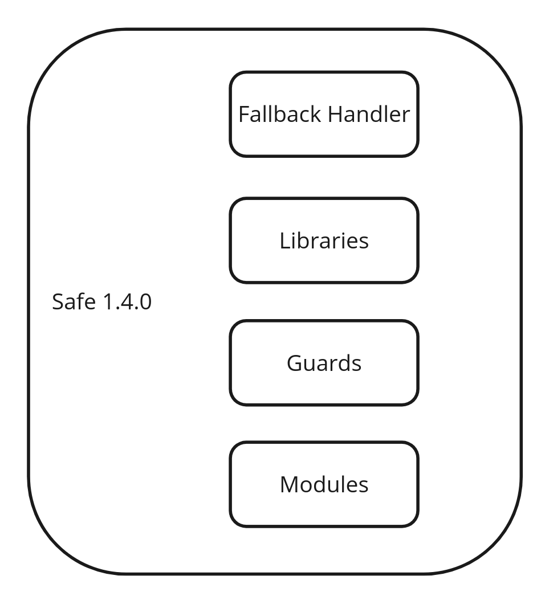

# Accounts

The Safe{Core} Protocol is designed to be **account agnostic**. This initial alpha version focuses on the 1.x versions of Safe Smart Accounts to expedite the development process and gather feedback. These learnings are the foundation upon which the protocol is opened to other account implementations.

## High-level overview

The [Safe{Core} Protocol Manager](https://github.com/safe-global/safe-core-protocol-specs/blob/2bffd759dd12be5583594f302d97c35e0ab9fcf5/manager/README.md) contract is the main entity interacting with accounts and vice versa. The Manager expects accounts to implement a specific interface, described in this document.

## API Specification

### General requirements

The Account MUST append the 20 bytes of the `msg.sender` address to the calldata to each Account configuration-related method (setting a hook,
adding a plugin, etc., for the full list, refer to [Manager's](../manager/README.md) specification). This is required because
to support some functionality, such as function handlers, an Account may be required to execute a CALL
operation that potentially bypasses the authorization to the Manager contract. This is required to allow the Manager to identify the transaction's sender. It is assumed
that the only way to have the `msg.sender` equal to the Account address in the call frame is to execute a call through the Account's built-in authorization scheme.

### Expected interface per Safe{Core} Protocol Module

#### Plugins

The account MUST implement the following interface:

```Solidity
interface IAccount {
    function execTransactionFromModuleReturnData(
        address to,
        uint256 value,
        bytes memory data,
        uint8 operation
    ) external returns (bool success, bytes memory returnData);
}
```

where:

| Type         | Name      | Description                                                                                                                                                                                                                                                                                                                                                                               |
|--------------|-----------|-------------------------------------------------------------------------------------------------------------------------------------------------------------------------------------------------------------------------------------------------------------------------------------------------------------------------------------------------------------------------------------------|
| address      | to        | The address of the contract to be called                                                                                                                                                                                                                                                                                                                                                  |
| uint256      | value     | The amount of Native Token to be sent                                                                                                                                                                                                                                                                                                                                                     |
| bytes memory | data      | The call data                                                                                                                                                                                                                                                                                                                                                                             |
| uint8        | operation | The operation type to be executed. `0` for CALL, `1` for DELEGATECALL. The DELEGATECALL operation can only be executed by a Plugin with root access permissions. More information about transaction types can be found in the [Manager contract](https://github.com/safe-global/safe-core-protocol-specs/blob/2bffd759dd12be5583594f302d97c35e0ab9fcf5/manager/README.md) specifications. |

The account MUST execute a corresponding `operation` to the `to` address with the provided `value` and `data` parameters. The account MUST return a tuple of `(bool success, bytes memory returnData)`. 
It is RECOMMENDED that the account supports the DELEGATECALL operation.

#### Hooks

Hooks do not require any specific interface to be implemented by the account. To use hooks, use the interface defined in the
[Safe{Core} Protocol Manager specification](../manager/README.md)

#### Function Handlers

The account MUST implement a `fallback` function, which forwards all the calldata
to the Safe{Core} Protocol Manager AND appends the 20 bytes of the `msg.sender` address to the calldata.

An example implementation of such a `fallback` function is:
```Solidity
    fallback() external {
        bytes32 slot = SAFE_CORE_PROTOCOL_MANAGER_SLOT;
        /// @solidity memory-safe-assembly
        assembly {
            function allocate(length) -> pos {
                pos := mload(0x40)
                mstore(0x40, add(pos, length))
            }

            let protocol := sload(slot)
            if iszero(protocol) {
                return(0, 0)
            }

            let calldataPtr := allocate(calldatasize())
            calldatacopy(calldataPtr, 0, calldatasize())

            // The msg.sender address is shifted to the left by 12 bytes to remove the padding
            // Then the address without padding is stored right after the calldata
            let senderPtr := allocate(20)
            mstore(senderPtr, shl(96, caller()))

            // Add 20 bytes for the address appended add the end
            let success := call(gas(), protocol, 0, calldataPtr, add(calldatasize(), 20), 0, 0)

            let returnDataPtr := allocate(returndatasize())
            returndatacopy(returnDataPtr, 0, returndatasize())
            if iszero(success) {
                revert(returnDataPtr, returndatasize())
            }
            return(returnDataPtr, returndatasize())
        }
    }
```

#### Signature Validators

1. The account MUST follow the requirements defined in the Function Handlers section, or the account MUST forward the EIP-1271 isValidSignature call to the Safe{Core} Validator Manager, following the expected encoding defined in the [Signature Validator specs](../modules/README.md).
2. The account MUST implement the following interface:

```Solidity
interface IAccount {
    function checkSignatures(bytes32 messageHash, bytes memory messageData, bytes memory signatures) external view;
}
```
where:
- `checkSignatures` function parameters are:

  | Type         | Name        | Description            |
  |--------------|-------------|------------------------|
  | bytes32      | messageHash | Hash of the message    |
  | bytes memory | messageData | EIP-712 pre-image data |
  | bytes memory | signatures  | Signature bytes        |

The function MUST revert if the signatures are not valid.

## Reference implementations

- [Safe{Core} Account](https://github.com/safe-global/safe-contracts) - starting from version 1.3.0



### Interface

```Solidity
interface ISafe {
    function execTransactionFromModuleReturnData(
        address to,
        uint256 value,
        bytes memory data,
        uint8 operation
    ) external returns (bool success, bytes memory returnData);
}
```
