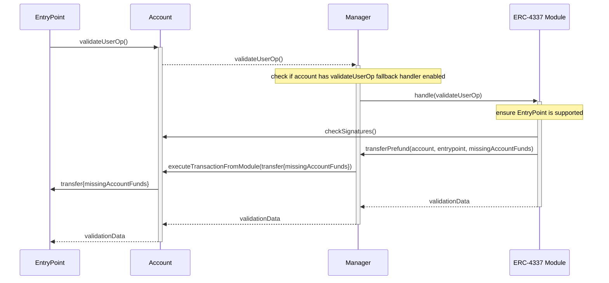
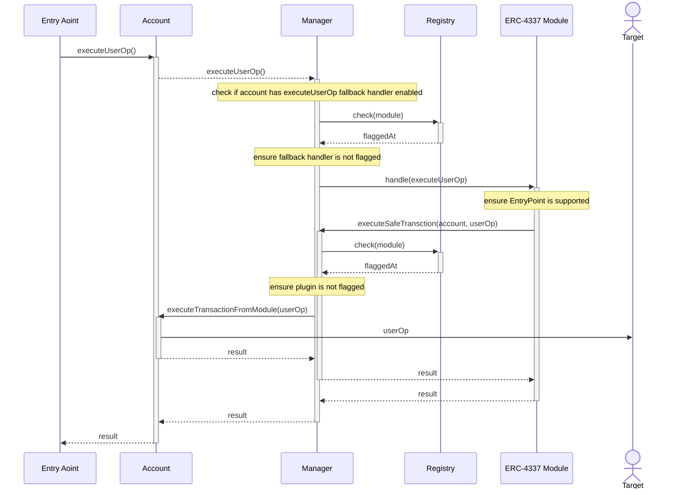

# Safe{Core} Protocol ERC-4337 Support

## Compatibility

Safe{Core} Protocol specification is meant to be compatible with [ERC-4337](https://eips.ethereum.org/EIPS/eip-4337). ERC-4337 enforces rules on the read/write operations that should be carefully looked into for the Safe{Core} Protocol implementation to be compatible with ERC-4337.

As per ERC-4337 specs state the following when validating a `UserOperation`:

> Storage access is limited as follows:
>
> - self storage (of factory/paymaster, respectively) is allowed, but only if self entity is staked
> - account storage access is allowed (see Storage access by Slots, below),
> - in any case, may not use storage used by another UserOp sender in the same bundle (that is, paymaster and factory are not allowed as senders

Storage associated with an account is defined as follows:

> An address `A` is associated with:
>
> - Slots of contract `A` address itself.
> - Slot `A` on any other address.
> - Slots of type `keccak256(A || X) + n` on any other address. (to cover `mapping(address => value)`, which is usually used for balance in ERC-20 tokens). `n` is an offset value up to 128, to allow accessing fields in the format `mapping(address => struct)`

As such, in order for the Safe{Core} Protocol to be ERC-4337 compatible without requiring a staked _paymaster_, the Manager MUST NOT make use of storage slots not associated with the account whose `UserOperation`s it is validating. Notably, this implies that `UserOperation` validation MUST be implemented without interacting with the Registry. If ERC-4337 `validateUserOp` support is implemented as a module, the Manager MUST NOT verify it is approved in the Registry. Note that this restriction only applies to `UserOperation` validation flow and notably does not apply to the `UserOperation` execution flow. The specification currently suggests that ERC-4337 `validateUserOp` SHOULD be directly supported in the Manager for these compatibility reasons.

In particular, the storage access limitations during `UserOperation` validation can be problematic when checking a module against the Registry as it is required to retrieve information associated with a module address (and not the account address). There are potential workarounds using contract code as storage [\[1\]](https://github.com/5afe/contract-storage) that would a Registry implementation to still validate a ERC-4337 module during the `UserOperation` validation phase, but they rely on `SELFDESTRUCT` which is a deprecated op-code and hence not recommended.

Additionally, developers aiming to develop plugins that are ERC-4337 compatible should be aware of storage access restrictions, opcode usage restrictions during the simulation step of ERC-4337 specification.

More details on this is available [here](https://github.com/safe-global/safe-core-protocol/issues/60#issuecomment-1761296305).

### Staking

The account SHOULD implement a staked _factory_ in order to enable `UserOperations` with `initCode`. ERC-4337 requires a staked _factory_ for `UserOperation` validation that reads associated account storage when `initCode` is specified. Since this specification permits Manager implementations that read account associated storage during `UserOperation` validation, the account _factory_ needs to be staked in order for _bundlers_ to accept `UserOperations` with `initCode`.

## Security Considerations

One of the main value propositions of the Safe{Core} Protocol is account security by verifying modules in the Registry. However, because of storage access restrictions imposed by the ERC-4337 spec (see Compatibility section above), this is not possible when validating user operations. However, this restriction does not apply to `UserOperation` execution.

In order to help protect accounts from any eventual vulnerabilities that may be discovered in the ERC-4337 _entrypoint_, The manager MUST validate `UserOperation` execution with the registry for the particular _entrypoint_ being used. Practically speaking this implies that the ERC-4337 `UserOperation` execution:
1. SHOULD be implemented as a fallback handler module with an immutable associated _entrypoint_ contract
2. MUST verify that the _entrypoint_ has been explicitly enabled by the account
3. MUST verify that the _entrypoint_ has not been flagged

Note that if the `UserOperation` execution is implemented as a module that only supports a single _entrypoint_, then the standard Registry check that the Manager is required to do for modules suffices for points 2 and 3 above. Otherwise the Manager MUST check that the _entrypoint_ has been enabled by the user and not been flagged through some other means. A sequence diagram detailing the required checks based on the recommended implementation is included in the Execution Flow section below.

By leveraging the Safe{Core} Protocol to verify whether or not _entrypoints_ are approved, the attack surface caused by an _entrypoint_ compromise is greatly reduced. In fact, the attack is limited to the Ether transfer from the `UserOperation` validation.

### Additional Security With `SELFDESTRUCT`

While a `validateUserOp` function handler module cannot verify if it is still approved in the registry, it MAY provide a mechanism for `SELFDESTRUCT`-ing the module's `validateUserOp` function implementation to further limit the potential damages in case a particular _entrypoint_ vulnerability is discovered. Note that this is not required, especially since the `SELFDESTRUCT` op-code is officially deprecated and may stop working in the future. Therefore, this is not a reliable way to protect `UserOperation` validation from _entrypoint_ vulnerabilities.

## Using ERC-4337

This section contains sequence diagrams for using ERC-4337 support in the Safe{Core} Protocol. **It assumes that ERC-4337 is implemented as a module**, but with additional special case support for ERC-4337 in the Manager (see Compatibility section for more details).

### Enabling ERC-4337

Enabling ERC-4337 on an account the following registrations for the ERC-4337 module implementation:

1. Fallback handler for `validateUserOp` and `executeUserOp` functions
2. Plugin (with or without root access, depending on what transactions the account wants to permit over ERC-4337).

### Validation Flow

### Execution Flow

