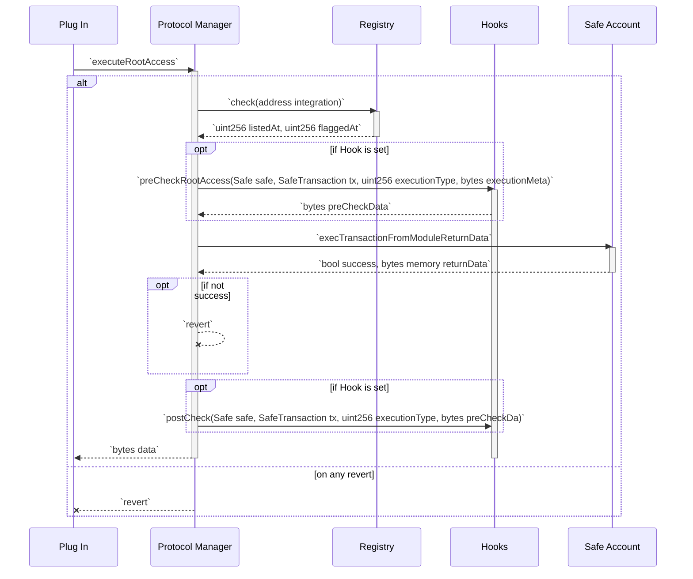

# Manager

At the heart of the protocol is the `Manager`, ensuring adherence to the prescribed conduct and procedures set by the `Registry`. The `Manager` serves as an intermediary layer coordinating communication and interactions between `Accounts` and `Modules`.

## General Types

```solidity
struct SafeProtocolAction {
    address to,
    uint256 value,
    bytes data
}
```

Safe transaction (invoked via `call`)

```solidity
struct SafeTransaction {
    address safe,
    SafeProtocolAction[] actions,
    uint256 nonce,
    bytes32 metadataHash
}
```

Safe root access (invoked via `delegatecall`)

```solidity
struct SafeRootAccess {
    address safe,
    SafeProtocolAction action,
    uint256 nonce,
    bytes32 metadataHash
}
```

Both `SafeTransaction` and `SafeRootAccess` MUST have a unique id, which is the EIP-712 hash of the object.

## Interface

```solidity
interface ISafeProtocolManager {
    function executeTransaction(Safe safe, SafeTransaction tx) external view returns (bytes[] memory data);
    function executeRootAccess(Safe safe, SafeRootAccess rootAccess) external view returns (bytes memory data);
}
```

To handle return data for `executeTransaction` (as it is an array of actions)
- The size of `data` must equal the size of the actions array.
- Each element in `data` corresponds to the action that has been executed i.e. `data[i]` is the result of `action[i]`.
- If execution of action(s) fail, the transaction must revert.

## Uniqueness

As mentioned before it is required that both `SafeTransaction` and `SafeRootAccess` can be uniquely identified. An example where this is important is tooling related to indexing and querying information for the modules. For this purpose a `nonce` field is present in the structs, which allows to make the hash calculated for these is unique.

**Important:** It is the responsibility of the integration (i.e. plugin) to ensure that each of structs can be uniquely identified.

## Flow Charts

### Root Access Flow



## Automatic Enforcements

TBD

## Upgradeability  

It is inevitable that more features will be added to Safe{Core} Protocol (e.g. new modules). As the Manager is the central part of this setup, it is important to consider a path for integrating these new features. Using an upgradeable proxy for the Manager would introduce unacceptable security concerns. Separating too much of the functionality into separate contract to allow reusability (i.e. the list of enabled integration) would increase the gas costs, and so is also not practical. A better pattern is to allow new versions of the Manager to load information from a previous version and thereby facilitate a migration.

## ERC-4337 compatibility

Safe{Core} Protocol specification is meant to be compatible with [ERC-4337](https://eips.ethereum.org/EIPS/eip-4337). ERC-4337 enforces rules on the the read/write operations that should be carefully looked into for the Safe{Core} Protocol implementation to be compatible with ERC-4337. 

As per ERC-4337 specs state the following when simulating a `UserOp` :

```
Storage access is limited as follows:
- self storage (of factory/paymaster, respectively) is allowed, but only if self entity is staked
- account storage access is allowed (see Storage access by Slots, below),
- in any case, may not use storage used by another UserOp sender in the same bundle (that is, paymaster and factory are not allowed as senders

Storage associated with an account is defined as follows:

An address A is associated with:
- Slots of contract A address itself.
- Slot A on any other address.
- Slots of type keccak256(A || X) + n on any other address. (to cover mapping(address => value), which is usually used for balance in ERC-20 tokens). n is an offset value up to 128, to allow accessing fields in the format mapping(address => struct)
```

The current Protocol Manager implementations specifies following operations that make use of storage slots that are not allowed by ERC-4337:

- Read the registry address from storage slot not associated with the account
    - When executing transaction from Plugin
    - When hooks are enabled
    - When validating signature
- Registry contract reads the storage associated with module address

Potential solutions:

- Avoid registry storage reads
- Adjust data structures to avoid reading storage not associated with account address

Developers aiming to develop plugins that are ERC-4337 compatible should be aware of storage access restrictions, opcode usage restrictions during the simulation step of ERC-4337 specification.

More details on this is available here: https://github.com/safe-global/safe-core-protocol/issues/60#issuecomment-1761296305