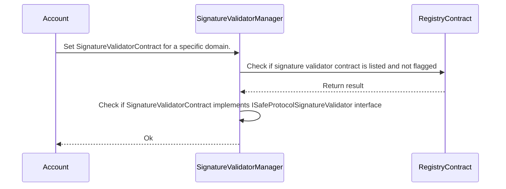
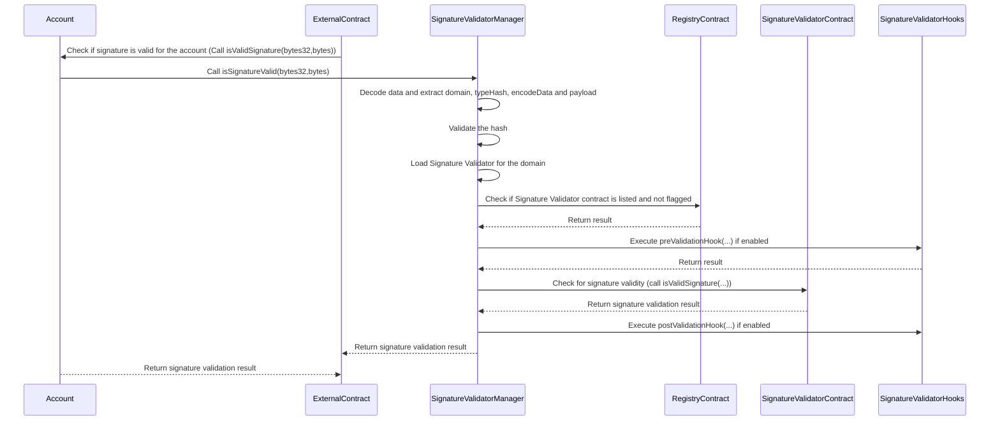

# Modules

Modules extend the functionality of Accounts in different ways. Initial modules are `plugins`, `hooks`, `function handlers` and `signature validators`, but additional modules can be added to the Safe{Core} Protocol at a later point.

[General Types](../manager/README.md#general-types)

## Module Types

Each module is assigned a value that represents the type of module it is. The value is a power of 2, which permits bitwise operations and efficient storage of values. The table below lists the module types and their corresponding values. A contract can be used as multiple module types.

| Module type         | Value |
|---------------------|-------|
| Plugin              | 1     |
| Function Handler    | 2     |
| Hooks               | 4     |
| Signature Validator | 8     |

## Plugins

Plugins allow to add any arbitrary logic to an account such as recovery mechanisms, session keys, and automations.

Plugins can trigger transactions on an `Account` via the `Manager`.

```solidity
interface ISafeProtocolPlugIn {
    function name() external view returns (string memory name);

    function version() external view returns (string memory version);

    function metaProvider() external view returns (uint256 type, bytes memory location);

    function requiresPermissions() external view returns (uint8 permissions);
}
```

### Plugin permissions

The table below elaborates the permission types that a plugin can have. For each transaction, the `Manager` will check if the plugin has the required permission. Each permission should be granted by the account explicitly. There is no hierarchy or precedence order for the permissions.

| **Permission name**  | **Value** | **Description**                                                                                                                                                                                                                                                                                  |
|----------------------|-----------|--------------------------------------------------------------------------------------------------------------------------------------------------------------------------------------------------------------------------------------------------------------------------------------------------|
| EXECUTE_CALL         | `1`       | Plugin can invoke `CALL` transactions through an account but, value of `to` cannot be the account itself.                                                                                                                                                                                        |
| CALL_TO_SELF         | `2`       | Plugin can invoke `CALL` transactions through an account but, value of `to` can only be the account itself. This permission is useful in cases where a plugin needs to modify the state of the account. For example, swapping owner of the account with a new owner during the recovery process. |
| EXECUTE_DELEGATECALL | `4`       | Plugin can invoke `DELEGATECALL` transactions through the account with no restriction on parameter values                                                                                                                                                                                        |

Inspired from [EIP-6617](https://eips.ethereum.org/EIPS/eip-6617), must `requiresPermissions()` returns a `uint8` that represents bit-based permissions. The manager interprets the returned value as a bit-based permission and checks if the Plugin has the required permission.

| Permission                                         | Bit Representation | uint8 Value |
|----------------------------------------------------|--------------------|-------------|
| EXECUTE_CALL                                       | 00000001           | 1           |
| CALL_TO_SELF                                       | 00000010           | 2           |
| EXECUTE_DELEGATECALL                               | 00000100           | 4           |
| EXECUTE_CALL + CALL_TO_SELF                        | 00000011           | 3           |
| EXECUTE_CALL + EXECUTE_DELEGATECALL                | 00000101           | 5           |
| CALL_TO_SELF + EXECUTE_DELEGATECALL                | 00000110           | 6           |
| EXECUTE_CALL + CALL_TO_SELF + EXECUTE_DELEGATECALL | 00000111           | 7           |

### Plugin Interface Extensions

- TBD: Gas Fee Payment Authorizer (allow 4337 and other relaying methods with plugins)

## Hooks

### Transaction execution from module hooks

Hooks add additional logic at certain points of the transaction lifecycle. Hooks enable various forms of security protections such as allow- and deny-lists, MEV-protections, risk-assessments, and more. The Safe{Core} Protocol currently recognizes the following types of hooks:
- `preCheck` / `preCheckRootAccess` verify custom conditions using the state before a transaction is executed
- `postCheck` verify custom conditions at the end of a transaction and reverts 

Hooks can check any interaction done with an `Account` via the `Manager`, and also check direct (some) direct interactions on the `Account`(i.e. via the `execTransaction` flow).

```solidity
interface ISafeProtocolHooks {
    function preCheck(address account, SafeTransaction tx, uint8 executionType, bytes calldata executionMeta) external returns (bytes memory preCheckData);

    function preCheckRootAccess(address account, SafeRootAccess rootAccess, uint8 executionType, bytes calldata executionMeta) external returns (bytes memory preCheckData);

    function postCheck(address account, bool success, bytes calldata preCheckData) external;
}
```

### Signature validator hooks

Signature validation is a critical part of smart contract accounts. A flawed implementation of validation logic can lead to approving a transaction with an invalid signature. Signature validator hooks can be used to add safety net to the signature validation process and hold the power to block a signature validator from approving unauthorized actions. Hooks can be enabled for all validators before and after execution of the validation function. This can be done by adding contract implementing `ISignatureValidatorHook` interface to the `SignatureValidatorManager` by the account. The hooks are not specific to a domain and are executed for all signature validations. The hooks function(s) should revert on failed checks.

```solidity
interface ISignatureValidatorHooks {
    /**
     * @param account Address of the account for which signature is being validated
     * @param validator Address of the validator contract to be used for signature validation
     * @param data Bytes containing domain, typeHash, encodeData length, encodeData, signature length, signature, and additional data length, and additional data
     */
    function preValidationHook(address account, address validator, bytes payload) returns (bytes32 result) external;

    /**
     * @param account Address of the account for which signature is being validated
     * @param preValidationData Data returned by preValidationHook
     */
    function postValidationHook(address account, bytes32 preValidationData) returns (bytes32 result) external;
}
```

### Parameter `executionMeta` value

| Execution Type                                                                                                                                                                                 | Value                                                                                                                                                                                        |
|------------------------------------------------------------------------------------------------------------------------------------------------------------------------------------------------|----------------------------------------------------------------------------------------------------------------------------------------------------------------------------------------------|
| Multisignature Flow (for accounts that use [Guard interface](https://github.com/safe-global/safe-contracts/blob/8ffae95faa815acf86ec8b50021ebe9f96abde10/contracts/base/GuardManager.sol#L10)) | Encoded data created from parameter values received from `checkTransaction(...)` i.e. `abi.encode(to, value, data, gas, baseGas, gasPrice, gasToken, refundReceiver, signatures, msgSender)` |
| Plugin Flow                                                                                                                                                                                    | Encoded address of the Plugin i.e. `abi.encode(pluginAddress)`                                                                                                                               |

### Parameter `executionType` value

| Execution Type      | Value |
|---------------------|-------|
| Multisignature Flow | `0`   |
| Plugin Flow         | `1`   |

TODO: provide more details on execution metadata

## Function handler

Non-static version (invoked via `call`)

```solidity
interface ISafeProtocolFunctionHandler {
    function handle(address account, address sender, uint256 value, bytes calldata data) external returns (bytes memory result);
}
```

    function metadataProvider() external view returns (uint256 type, bytes memory location);

```solidity
interface ISafeProtocolStaticFunctionHandler {
    function handle(address account, address sender, uint256 value, bytes calldata data) external view returns (bytes memory result);
}
```

Kudos to @mfw78

## Signature validators

There are continuous efforts to expand the types of signatures supported by the EVM beyond the currently predominant secp256k1 elliptic curve. For example, a signature scheme gaining popularity is based on the secp256r1 elliptic curve (see EIP-7212). Signature Validators allow accounts to support new standards and enable use-cases such as Passkeys-enabled smart accounts, BLS/Schnorr or quantum-secure signatures.
Inspired from [EIP-712](https://eips.ethereum.org/EIPS/eip-712) which specifies standard for typed structured data hashing and signing, a signature validator is expected to validate a signed message for a specific domain. To do so, a signature validator manager contract acts as a storage for maintaining enabled validators (approved by the registry) per domain per account.

First, a signature validator must be enabled by the account for a specific domain which is outlined by the below sequence diagram.



The above sequence diagram only covers a flow when the transaction executes successfully.
The possible cases for a transaction to revert are:
- Signature validator contract is not listed in registry
- Signature validator contract is flagged in registry
- Transaction ran out of gas

After a enabling a signature validator, external entities can request validating account signatures. The diagram below illustrates the sequence of calls that are made when a signature is to be validated. The `Account` sets the `SignatureValidatorContract` for a specific domain via the `SignatureValidatorManager`. When a signature for an account is to be validated by an external entity, here referred as `ExternalContract`, the `ExternalContract` contract calls the `isValidSignature(bytes32,bytes)` function supported by the account. Account further calls `SignatureValidatorManager`. If the signature validator contract is set for the account, listed and not flagged, the `SignatureValidatorManager` calls the `SignatureValidatorContract` to check if the signature is valid. Additionally, hooks for signature validators help to provide a way to add additional checks before and after the calling a signature validation function.



The above sequence diagram only covers a flow when the signature validator contract and hooks are set, and the transaction executes successfully.
The possible cases for a transaction to revert are:
- No Signature validator contract is set for the domain
- Invalid message hash 
- Signature validator contract is not listed in registry
- Signature validator contract is flagged in registry
- Decoding of data failed
- If signature validator hook is enable, call to `preValidationHook(...)` reverted
- Call to signature validator contract reverted
- If signature validator hook is enable, call to `postValidationHook(...)` reverted
- Transaction ran out of gas

The Layout of the encoded data received by the signature validator is expected to be as follows:

| Start                                                       | End                                                         | Description               |
|-------------------------------------------------------------|-------------------------------------------------------------|---------------------------|
| 0x00                                                        | 0x04                                                        | 4 bytes function selector |
| 0x04                                                        | 0x24                                                        | dataHash                  |
| 0x24                                                        | 0x44                                                        | domainSeparator           |
| 0x44                                                        | 0x64                                                        | typeHash                  |
| 0x64                                                        | 0x84                                                        | encodeData length         |
| 0x84                                                        | <0x84 + encodeData length>                                  | encodeData                |
| <0x84 + encodeData length>                                  | <0x84 + encodeData length> + 0x20                           | signature length          |
| <0x84 + encodeData length> + 0x20                           | <0x84 + encodeData length> + 0x20 + signature length        | signature                 |

### SignatureValidatorManager with SafeProtocolManager

An account can either implement logic to call `SignatureValidatorManager` for validating signature or set `SafeProtocolManager` as a fallback handler and set `SignatureValidatorManager` as function handler for [isValidSignature(bytes32,bytes)](https://eips.ethereum.org/EIPS/eip-1271) function in the manager. So, when a contract wants to verify account signature, it should call `isValidSignature(bytes32,bytes)` on the account and the `SafeProtocolManager` will forward the call to the `SignatureValidatorManager` which will call the `SignatureValidatorContract` to check if the signature is valid.

### Signature validator interface

A signature validator must implement the following interface.

```solidity
interface ISafeProtocolSignatureValidator {
    /**
     * @param safe The Safe that has delegated the signature verification
     * @param sender The address that originally called the Safe's `isValidSignature` method
     * @param hash The EIP-712 hash whose signature will be verified
     * @param domainSeparator The EIP-712 domainSeparator
     * @param typeHash The EIP-712 typeHash
     * @param encodeData The EIP-712 encoded data
     * @param signature An arbitrary payload that can be used to pass additional data to the validator.
     * @param additionalData An arbitrary payload that can be used to pass additional data to the validator.
     * @return magic The magic value that should be returned if the signature is valid (0x1626ba7e)
     */
    function isValidSignature(
        address account,
        address sender,
        bytes32 hash,
        bytes32 domainSeparator,
        bytes32 typeHash,
        bytes calldata encodeData,
        bytes calldata signatures
        bytes calldata additionalData
    ) external view returns (bytes4 magic);
}
```

### Signature validator manager

A signature validator manager must implement the following interface.

```solidity
interface ISafeProtocolSignatureValidatorManager {

    /**
     * @notice A view function that the Manager will call when an account has enabled this contract as a function handler in the Manager for function isSignatureValid(bytes32,bytes)
     * @param account Address of the account whose signature validator is to be used
     * @param sender Address requesting signature validation
     * @param data Calldata containing the function selector, signature hash, domain separator, type hash, encoded data and payload forwarded by the Manager
     *              Arbitrary data containing the following layout:
     *              Layout of the data:
     *                  0x00 to 0x04: 4 bytes function selector i.e. bytes4(keccak256("isValidSignature(bytes32,bytes)") (= 0x1626ba7e)
     *                  0x04 to 0x24: dataHash
     *                  0x24 to 0x44: domainSeparator
     *                  0x44 to 0x64: typeHash
     *                  0x64 to 0x84: encodeData length
     *                  0x84 to <0x84 + encodeData length>: encodeData
     *                  <0x84 + encodeData length> to <0x84 + encodeData length> + 0x20 : signature length
     *                  <0x84 + encodeData length> + 0x20 to <0x84 + encodeData length> + 0x20 + signature length: signature
     */
    function handle(
        address account,
        address sender,
        uint256 /* value */,
        bytes calldata data
    ) external view override returns (bytes memory);

    /**
     * @param domain bytes32 containing the domain for which Signature Validator contract should be used
     * @param signatureValidatorContract Address of the Signature Validator Contract implementing ISafeProtocolSignatureValidator interface
     */
    function setSignatureValidator(bytes32 domain, address signatureValidatorContract) external;

    /**
     * @param signatureValidatorHooksContract Address of the contract to be used as Hooks for Signature Validator implementing ISignatureValidatorHook interface
     */
    function setSignatureValidatorHooks(address signatureValidatorHooksContract) external;
}
```

Kudos to @mfw78

References:
- https://github.com/zerodevapp/kernel/blob/main/src/interfaces/IValidator.sol
- https://eips.ethereum.org/EIPS/eip-6900